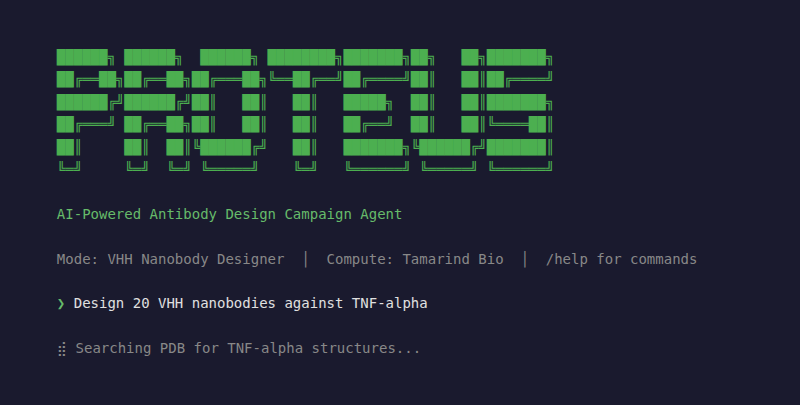
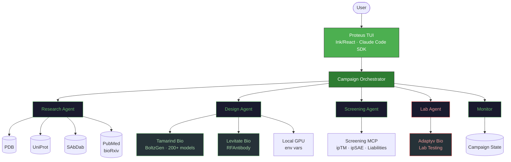
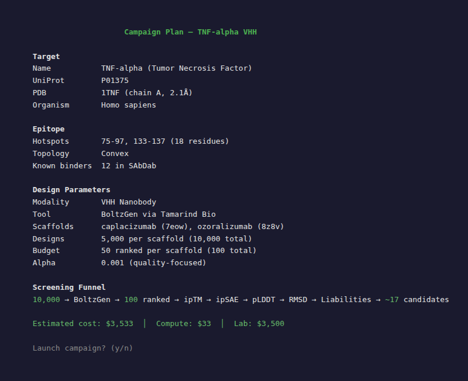
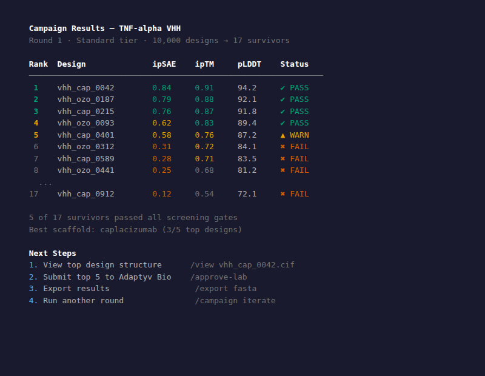
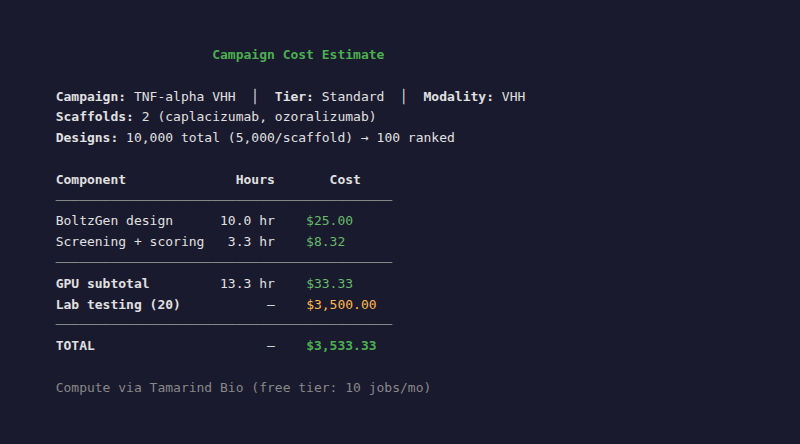

<div align="center">

```
 ██████╗ ██████╗  ██████╗ ████████╗███████╗██╗   ██╗███████╗
 ██╔══██╗██╔══██╗██╔═══██╗╚══██╔══╝██╔════╝██║   ██║██╔════╝
 ██████╔╝██████╔╝██║   ██║   ██║   █████╗  ██║   ██║███████╗
 ██╔═══╝ ██╔══██╗██║   ██║   ██║   ██╔══╝  ██║   ██║╚════██║
 ██║     ██║  ██║╚██████╔╝   ██║   ███████╗╚██████╔╝███████║
 ╚═╝     ╚═╝  ╚═╝ ╚═════╝    ╚═╝   ╚══════╝ ╚═════╝ ╚══════╝
```

</div>

<p align="center">
  <em>AI-Powered Antibody Design Campaign Agent</em>
</p>

<p align="center">
  <a href="LICENSE"></a>
  <a href="https://nodejs.org/">= 18"></a>
  <a href="https://www.python.org/">= 3.10"></a>
  <a href="https://docs.anthropic.com/en/docs/claude-code"></a>
  <a href="https://github.com/001TMF/proteus-agent/pulls"></a>
</p>

<p align="center">
  
</p>


---

Design antibodies from target to lab in one conversation. Proteus is a multi-agent campaign system that orchestrates the full antibody design lifecycle -- target research, structure prediction, binder generation, computational screening, and lab submission -- all from a terminal interface powered by Claude Code.

## Features

<table>
<tr>
<td width="33%" valign="top">

**Design Modalities**

VHH nanobodies, scFv antibodies, and de novo protein binders. BoltzGen diffusion + Protenix refolding.

</td>
<td width="33%" valign="top">

**Cloud-First Compute**

Tamarind Bio as default (200+ models, free tier). Levitate Bio and local GPU as alternatives.

</td>
<td width="33%" valign="top">

**Multi-Agent Teams**

6 specialized agents: Research, Design, Screening, Lab Integration, Monitor, Campaign Director.

</td>
</tr>
<tr>
<td width="33%" valign="top">

**Lab Integration**

Adaptyv Bio wet-lab testing with a triple-layer safety gate. No accidental submissions.

</td>
<td width="33%" valign="top">

**Academic Research**

PubMed, bioRxiv, PDB, UniProt, and SAbDab wired in as MCP servers. Prior art in seconds.

</td>
<td width="33%" valign="top">

**Campaign Management**

Cost modeling, screening funnels, iteration tracking. From $5 previews to $19K production runs.

</td>
</tr>
</table>

## Quick Start

```bash
git clone https://github.com/001TMF/proteus.git
cd proteus
cp .env.example .env
# Add your TAMARIND_API_KEY (free at https://app.tamarind.bio)

cd harness && npm install && npm run dev
```

On first launch, Proteus detects available compute providers from your `.env` and configures itself automatically. No Tamarind key? It will prompt you -- the free tier gives 10 jobs/month, enough to run a preview campaign.

## Design Modalities

| Modality | Engine | Protocol | Scaffolds | Typical Designs | Use Case |
|----------|--------|----------|-----------|-----------------|----------|
| **VHH nanobody** | BoltzGen | `nanobody-anything` | caplacizumab, ozoralizumab, vobarilizumab, gefurulimab | 5K--10K | Small, stable single-domain binders. Ideal for imaging, diagnostics, and bispecifics. |
| **scFv antibody** | BoltzGen | `antibody-anything` | adalimumab, dupilumab, nirsevimab + 11 more Fab templates | 5K--10K | Traditional antibody variable fragments. IgG-convertible. |
| **De novo binder** | PXDesign | `extended` preset | N/A (designed from scratch) | 500--50K | Miniprotein binders with no immunoglobulin scaffold. 17--82% experimental hit rates. |

All modalities feed into the same screening pipeline and can be mixed within a single campaign.

## Campaign Tiers

| Tier | Cost | Designs | Refolding | Lab Candidates | Best For |
|------|------|---------|-----------|----------------|----------|
| **Preview** | ~$5 | 50 | 10 | -- | Quick feasibility check |
| **Standard** | ~$35/scaffold | 5,000 | 100 | 10--20 | Well-studied targets |
| **Production** | ~$140/scaffold | 10,000 | 500 | 20--50 | Serious campaigns, multiple scaffolds |
| **Exploratory** | ~$350/scaffold | 50,000 | 2,000 | 50+ | Novel targets, maximum diversity |

Costs are compute only (Tamarind + Protenix refolding). Lab testing via Adaptyv Bio is additional ($119--215/variant, 2--4 week turnaround).

## Architecture



## Agent Team

| Agent | Role | MCP Servers | Purpose |
|-------|------|-------------|---------|
| **Research** | Target intelligence | pdb, uniprot, sabdab, research | Gather target structure, known binders, epitope data, and prior art |
| **Design** | Binder generation | tamarind, levitate | Submit and monitor BoltzGen / PXDesign compute jobs |
| **Screening** | Computational triage | screening | Score, filter, and rank designs by ipTM, ipSAE, p_bind, liabilities |
| **Lab Integration** | Wet-lab bridge | adaptyv | Prepare and submit candidates to Adaptyv Bio (triple-gated) |
| **Monitor** | Job tracking | tamarind, levitate, campaign | Poll compute jobs, update campaign state, report progress |
| **Campaign Director** | Orchestration | campaign | Manage campaign lifecycle, cost tracking, iteration decisions |

## MCP Servers

Proteus exposes 9 MCP servers, each wrapping a focused set of tools:

| Server | Tools | Description |
|--------|-------|-------------|
| `proteus-pdb` | `pdb_search`, `pdb_fetch_structure`, `pdb_get_chains`, `pdb_interface_residues`, `pdb_download` | RCSB PDB structure search and analysis |
| `proteus-uniprot` | `uniprot_search`, `uniprot_fetch_protein`, `uniprot_get_domains`, `uniprot_get_variants` | UniProt protein metadata and annotations |
| `proteus-sabdab` | `sabdab_search` | SAbDab antibody structure database |
| `proteus-screening` | `screen_liabilities`, `screen_developability`, `score_ipsae`, `score_pbind`, `screen_composite` | Computational screening and custom scoring |
| `proteus-tamarind` | `tamarind_list_models`, `tamarind_submit_job`, `tamarind_get_job_status`, `tamarind_get_job_results` | Tamarind Bio cloud compute (200+ models) |
| `proteus-levitate` | `levitate_list_pipelines`, `levitate_run_rfantibody`, `levitate_run_analysis`, `levitate_get_results` | Levitate Bio alternative compute |
| `proteus-adaptyv` | `adaptyv_estimate_cost`, `adaptyv_prepare_submission`, `adaptyv_confirm_submission`, `adaptyv_get_results` | Adaptyv Bio lab integration (triple-gated) |
| `proteus-campaign` | `campaign_create`, `campaign_get`, `campaign_update_status`, `campaign_add_round`, `campaign_record_scores` | Campaign state management and cost tracking |
| `proteus-research` | `research_search_prior_art`, `research_get_target_info`, `research_analyze_known_binders` | Literature and prior art aggregation |

## Screening Pipeline

Every design passes through a multi-stage computational funnel before reaching lab consideration:

```
  10,000 designs
      │
      ▼
  ┌──────────┐
  │ BoltzGen │  Generate diverse CDR sequences via guided diffusion
  └────┬─────┘
       │
      ▼
  ┌───────────┐
  │ Protenix  │  Refold top candidates (AF3-class structure prediction)
  │ Refolding │
  └────┬──────┘
       │
      ▼
  100 refolded structures
       │
       ├── ipTM > 0.5          Hard structural confidence filter
       ├── ipSAE > 0.3         Custom TM-align interface score
       ├── pLDDT > 70          Per-residue confidence
       ├── RMSD < 5.0 A        Structural deviation
       │
      ▼
  ┌─────────────┐
  │ Liabilities │  NG/NS deamidation, DG isomerization, Met oxidation,
  │   Screen    │  free Cys, NXS/T glycosylation
  └────┬────────┘
       │
      ▼
  ┌───────────────┐
  │Developability │  Net charge, CDR length, hydrophobic fraction,
  │    Screen     │  TAP guidelines, composition flags
  └────┬──────────┘
       │
      ▼
  ┌──────────────────┐
  │ Composite Score  │  Weighted: ipTM(0.30) + ipSAE(0.25) + p_bind(0.20)
  │    & Ranking     │  + liability_penalty(0.15) + developability(0.10)
  └────┬─────────────┘
       │
      ▼
  15-20 candidates ──► Lab (Adaptyv Bio)
```

## Lab Safety Gate

Lab submissions to Adaptyv Bio are protected by a triple-layer safety gate. No accidental or unauthorized submissions are possible.

| Layer | Mechanism | What It Prevents |
|-------|-----------|------------------|
| **1. TUI gate** | User must type `/approve-lab` in the terminal | Agent cannot autonomously initiate submissions |
| **2. Confirmation code** | `adaptyv_prepare_submission` returns a one-time code valid for 5 minutes | Stale or replayed submissions |
| **3. Explicit confirm** | User must type `CONFIRM` with the exact code to execute `adaptyv_confirm_submission` | Accidental approval |

Cost estimates via `adaptyv_estimate_cost` are always safe to run -- they never trigger a submission.

## Campaign Cost Reference

Based on real-world antibody design economics ([Asimov Press](https://press.asimov.com/)):

| Campaign Type | Compute | Lab Testing | Total |
|---------------|---------|-------------|-------|
| **Minimum viable** | ~$500 (10K designs, 100 refolded) | ~$3,500 (10 variants x $175 + $1,750 setup) | **~$4,000** |
| **Standard full** | ~$2,000 (50K designs, 500 refolded) | ~$14,000 (50 variants x $175 + $5,250 setup) | **~$16,000** |
| **Production** | ~$4,000 (100K designs, 2K refolded) | ~$15,000 (50 variants x $215 + $4,250 setup) | **~$19,000** |

Success rates are highly target-dependent (1--89% in literature). Well-studied targets with known epitopes have the best odds.

## Configuration

Campaigns are defined in YAML. Here is a real example for anti-TNF-alpha VHH nanobodies:

```yaml
name: "tnfa_vhh_standard"
tier: "standard"
target_difficulty: "well-studied"

target:
  name: "TNF-alpha"
  pdb_id: "1TNF"
  chain_id: "A"
  uniprot_id: "P01375"

epitope:
  hotspot_residues: [75, 76, 77, 79, 81, 87, 88, 89, 90, 91, 92, 95, 96, 97, 133, 135, 136, 137]
  region_notation: "75..97,133..137"

design:
  tool: "boltzgen"
  modality: "vhh"
  protocol: "nanobody-anything"
  scaffolds:
    - name: "caplacizumab"
      pdb: "7eow"
    - name: "ozoralizumab"
      pdb: "8z8v"
  designs_per_scaffold: 5000

screening:
  hard_filters:
    iptm_min: 0.5
    ipsae_min: 0.3
    plddt_min: 70
    rmsd_max: 5.0
  ranking_weights:
    iptm: 0.30
    ipsae_min: 0.25
    pbind: 0.20
    liability_penalty: 0.15
    developability: 0.10

lab:
  max_candidates: 20
  cost_per_variant_usd: 175
  provider: "adaptyv_bio"

compute:
  provider: "tamarind"
  gpu_type: "A100"
```

## Environment Variables

```bash
# Tamarind Bio (DEFAULT compute -- free tier: 10 jobs/month)
# Get your key at https://app.tamarind.bio
TAMARIND_API_KEY=

# Levitate Bio (alternative compute)
# Get credentials at https://levitate.bio
LEVITATE_CLIENT_ID=
LEVITATE_CLIENT_SECRET=

# Adaptyv Bio (lab testing -- REQUIRES explicit approval via /approve-lab)
# Get your token at https://www.adaptyvbio.com
ADAPTYV_API_TOKEN=
```

Only `TAMARIND_API_KEY` is required to get started. The free tier is sufficient for preview campaigns.

## Project Structure

```
proteus/
├── harness/                  # TypeScript TUI (Ink/React)
│   └── src/
│       ├── index.ts          # Entry point
│       ├── app.tsx           # Main React component
│       ├── banner.ts         # ASCII banner
│       ├── theme.ts          # Green terminal theme (#4CAF50)
│       ├── agents/           # Agent team definitions
│       ├── components/       # UI components
│       └── hooks/            # React hooks
├── src/
│   └── proteus_cli/          # Python CLI wrappers
│       ├── main.py           # CLI entry point
│       └── campaign/         # Campaign management
├── mcp_servers/              # 9 MCP servers (FastMCP)
│   ├── pdb/                  # RCSB PDB
│   ├── uniprot/              # UniProt
│   ├── sabdab/               # SAbDab
│   ├── screening/            # Scoring & screening
│   ├── tamarind/             # Tamarind Bio compute
│   ├── levitate/             # Levitate Bio compute
│   ├── adaptyv/              # Adaptyv Bio lab
│   ├── campaign/             # Campaign state
│   └── research/             # Literature search
├── examples/                 # Campaign config examples
│   ├── tnfa-vhh/             # TNF-alpha nanobody campaign
│   └── pdl1-binder/          # PD-L1 de novo binder campaign
├── campaigns/                # Active campaign data
├── plugin-manifest.json      # Tool & server manifest
├── .env.example              # Environment variable template
└── pyproject.toml            # Python project config
```

## Screenshots

<p align="center">
  
</p>

<p align="center">
  
</p>

<p align="center">
  
</p>


## Contributing

Contributions are welcome. Here is how to get started:

1. Fork the repository
2. Create a feature branch (`git checkout -b feature/my-feature`)
3. Make your changes
4. Run `cd harness && npm run typecheck` to verify TypeScript
5. Open a pull request against `main`

Please open an issue first for major changes to discuss the approach.

## License

[MIT](LICENSE)

## Acknowledgments

- **[BoltzGen](https://github.com/jostorge/boltzgen)** (MIT) by Hannes Stark et al. -- stochastic optimal control for antibody design
- **[Tamarind Bio](https://tamarind.bio)** -- cloud compute platform with 200+ structure biology models
- **[Adaptyv Bio](https://www.adaptyvbio.com)** -- wet-lab antibody testing and validation
- **[Protenix](https://github.com/bytedance/protenix)** by ByteDance -- AF3-class structure prediction (368M params)
- **[PXDesign](https://github.com/bytedance/pxdesign)** by ByteDance -- de novo protein binder design
- **[Claude Code SDK](https://docs.anthropic.com/en/docs/claude-code)** by Anthropic -- agent framework powering the TUI
