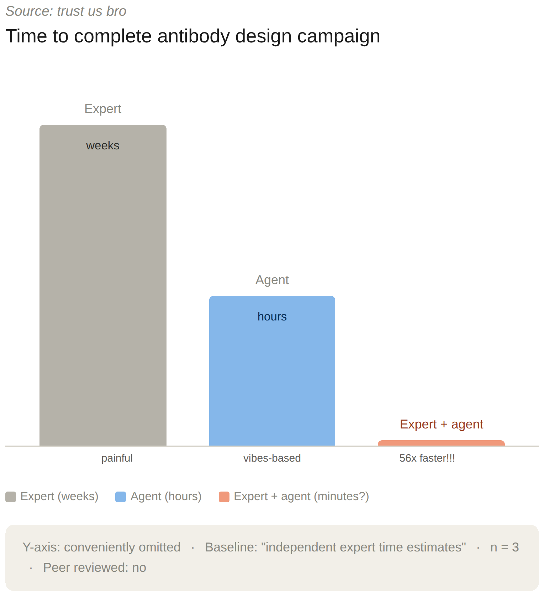
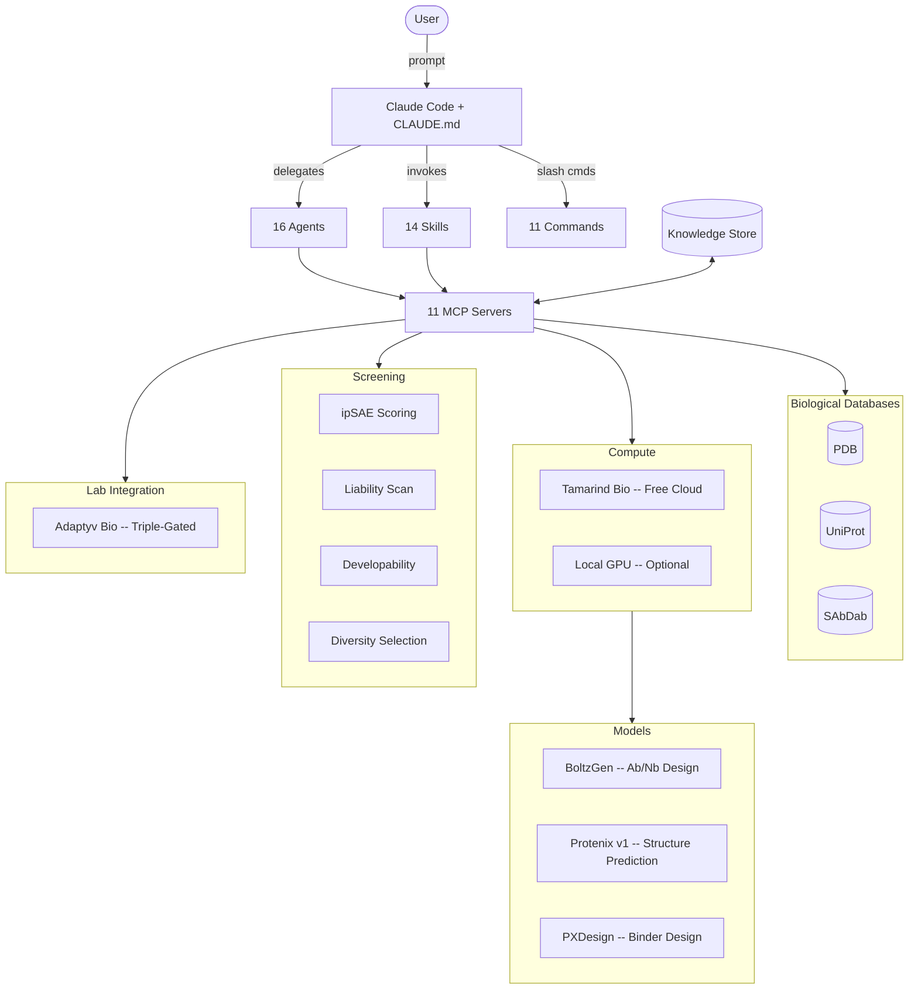

<p align="center">
  
</p>

<p align="center">
  <a href="LICENSE"></a>
  <a href="https://github.com/001TMF/blatant-why/pulls"></a>
  
  
  
</p>

<h3 align="center">Open-source protein design agent for Claude Code</h3>

<p align="center">
Commercial platforms wrap open-source tools behind paywalls and call it a revolution.<br>
BY gives you direct access through Claude Code. No platform fees. Your tools, your compute, your designs.
</p>

---

<p align="center">
  
</p>
<p align="center"><sub>Source: trust us bro</sub></p>

---

## Quick Start

```bash
npx blatant-why init
claude
> "Design VHH nanobodies against PD-L1"
```

`blatant-why init` scaffolds everything Claude Code needs -- 11 MCP servers, 16 agents, 14 skills, 11 slash commands, and a CLAUDE.md orchestration file. Open Claude Code in the same directory and start designing.

**Prerequisites:** [Claude Code](https://docs.anthropic.com/en/docs/claude-code), [uv](https://docs.astral.sh/uv/), Python 3.11+, Node.js 18+

---

## What It Does

Give it a target protein. It researches across PDB, UniProt, and SAbDab. It plans a design campaign. It submits compute jobs to Tamarind Bio (free tier, no GPU required). It screens every design for structural quality, sequence liabilities, and developability. It ranks candidates by composite score. You get a table of lab-ready binders.

The whole pipeline runs inside Claude Code. No platform. No dashboard. No vendor lock-in.

---

## What's Inside

| Component | Count | Description |
|-----------|-------|-------------|
| MCP Servers | 11 | Biological databases, cloud compute, screening, campaign state, knowledge store |
| Agents | 16 | Research, design, screening, evaluation, lab integration, and more |
| Skills | 14 | BoltzGen, Protenix, PXDesign, scoring, epitope analysis, campaign management |
| Slash Commands | 11 | Campaign control from the Claude Code prompt |

<details>
<summary><strong>MCP Servers (11)</strong></summary>

| Server | Role |
|--------|------|
| `pdb` | Protein Data Bank queries |
| `uniprot` | UniProt protein annotation |
| `sabdab` | Structural Antibody Database |
| `screening` | Screening battery orchestration |
| `tamarind` | Tamarind Bio cloud compute |
| `cloud` | Cloud compute abstraction |
| `adaptyv` | Adaptyv Bio lab submission (gated) |
| `campaign` | Campaign state management |
| `research` | Literature and target research |
| `local_compute` | Local GPU compute dispatch |
| `knowledge` | JSON-backed campaign knowledge store |

</details>

<details>
<summary><strong>Agents (16)</strong></summary>

| Agent | Role |
|-------|------|
| `by-research` | Target analysis, literature review, prior art |
| `by-design` | Generate designs via cloud or local pipelines |
| `by-screening` | Score, filter, rank candidates |
| `by-evaluator` | Structural evaluation and quality assessment |
| `by-visualization` | Structure and results visualization |
| `by-diversity` | Sequence and structural diversity selection |
| `by-campaign` | Campaign lifecycle orchestration |
| `by-knowledge` | Learning system and campaign memory |
| `by-verifier` | Output verification and sanity checks |
| `by-plan-checker` | Campaign plan validation |
| `by-environment` | Environment setup and dependency checks |
| `by-lab` | Adaptyv Bio lab submission (triple-gated) |
| `by-epitope` | Epitope analysis and mapping |
| `by-humanization` | Antibody humanization engineering |
| `by-liability-engineer` | Sequence liability detection and fixes |
| `by-formatter` | Output formatting and reporting |

</details>

<details>
<summary><strong>Skills (14)</strong></summary>

| Skill | Description |
|-------|-------------|
| `boltzgen` | BoltzGen antibody/nanobody generation |
| `protenix` | Protenix structure prediction |
| `pxdesign` | PXDesign de novo binder design |
| `by-scoring` | ipSAE + p_bind composite scoring |
| `by-screening` | Full screening battery |
| `by-epitope-analysis` | Epitope mapping and analysis |
| `by-campaign-manager` | Campaign state and lifecycle |
| `by-campaign-optimizer` | Active learning and iteration |
| `by-design-workflow` | End-to-end design pipeline |
| `by-research` | Target research and literature |
| `by-knowledge` | Campaign knowledge operations |
| `by-database` | Local results database |
| `by-failure-diagnosis` | Pipeline failure analysis |
| `by-hypothesis-debate` | Multi-agent hypothesis evaluation |

</details>

<details>
<summary><strong>Slash Commands (11)</strong></summary>

| Command | Action |
|---------|--------|
| `/by:load` | Load a campaign from file |
| `/by:screen` | Run screening battery on designs |
| `/by:results` | Display campaign results table |
| `/by:watch` | Live-watch running compute jobs |
| `/by:status` | Campaign status dashboard |
| `/by:approve-lab` | Approve Adaptyv Bio submission (gated) |
| `/by:set-profile` | Switch compute profile |
| `/by:setup` | Initialize environment and dependencies |
| `/by:plan-campaign` | Generate a detailed campaign plan |
| `/by:welcome` | Show welcome message and quick-start guide |
| `/by:resume` | Resume an interrupted or paused campaign |

</details>

---

## Setup

### API Keys

| Key | Required? | Where to get it | What it enables |
|-----|-----------|-----------------|-----------------|
| `TAMARIND_API_KEY` | Recommended | [tamarind.bio](https://tamarind.bio) (free account) | Cloud compute -- BoltzGen, Protenix, 200+ models. Free tier: 10 jobs/month |
| `ADAPTYV_API_TOKEN` | Optional | [adaptyvbio.com](https://www.adaptyvbio.com) | Lab testing submission (triple-gated) |

Claude Code handles its own authentication. No separate Anthropic API key needed.

### Configure your environment

After `npx blatant-why init`:

1. Copy `.env.example` to `.env`
2. Add your Tamarind key:
   ```
   TAMARIND_API_KEY=your_key_here
   ```
3. For local GPU (optional):
   ```
   PROTEUS_FOLD_DIR=/path/to/Protenix
   PROTEUS_PROT_DIR=/path/to/PXDesign
   PROTEUS_AB_DIR=/path/to/boltzgen
   ```
4. For SSH remotes (optional):
   Add host configs to `.by/config.json`

### Compute Options

| Provider | Cost | Setup | Best for |
|----------|------|-------|----------|
| **Tamarind Bio** | Free tier: 10 jobs/month | Just add API key | Getting started, small campaigns |
| **Tamarind Paid** | Pay per job | Same API key | Production campaigns |
| **Local GPU** | Your hardware | Install tools + set env vars | Power users with GPUs |
| **SSH Remote** | Your infrastructure | Configure in `.by/config.json` | HPC clusters, cloud GPUs |

---

## Architecture



<details>
<summary><strong>Model Profiles</strong></summary>

| Model | Type | What It Does |
|-------|------|--------------|
| **Protenix v1** | Structure prediction (368M params) | AlphaFold3-class folding -- protein, nucleic acid, ligand |
| **PXDesign** | De novo binder design | 17-82% hit rates on published benchmarks |
| **BoltzGen** | Antibody/nanobody design | Boltzmann generator + Protenix confidence scoring |

</details>

<details>
<summary><strong>Learning System</strong></summary>

Every campaign writes results to a JSON knowledge store. The knowledge MCP server provides keyword search over past campaigns, so the system learns which design strategies work for which target classes.

Stored per campaign:
- Target metadata and research context
- Design parameters and compute profiles
- Screening results and composite scores
- Success/failure annotations

Over time, the agent develops institutional memory about what works.

</details>

<details>
<summary><strong>Repository Structure</strong></summary>

```
blatant-why/
├── assets/                  # Banner and diagrams
├── src/
│   ├── init-cli/            # npx blatant-why init CLI
│   └── proteus_cli/         # Python CLI (scoring, screening, campaign)
├── templates/               # Deployed by init CLI
│   └── .claude/
│       ├── agents/          # 16 specialized agents
│       ├── commands/by/     # 11 slash commands
│       ├── skills/          # 14 skills
│       └── mcp_servers/     # 11 MCP server implementations
├── tests/                   # Test suite
├── CLAUDE.md                # Agent orchestration rules
├── package.json             # npm package
├── pyproject.toml           # Python package (uv)
└── README.md
```

</details>

---

## Credits

**Built by** [Tristan Farmer](https://www.linkedin.com/in/tristan-farmer-973b7a17a/)

- [Hannes Stark](https://github.com/jostorge/boltzgen) and the MIT team for BoltzGen
- [Deniz Kavi](https://tamarind.bio) and Sherry Liu at Tamarind Bio
- [Julian Englert](https://www.adaptyvbio.com) at Adaptyv Bio
- The [Claude Code](https://docs.anthropic.com/en/docs/claude-code) team

---

## License

[MIT](LICENSE)
