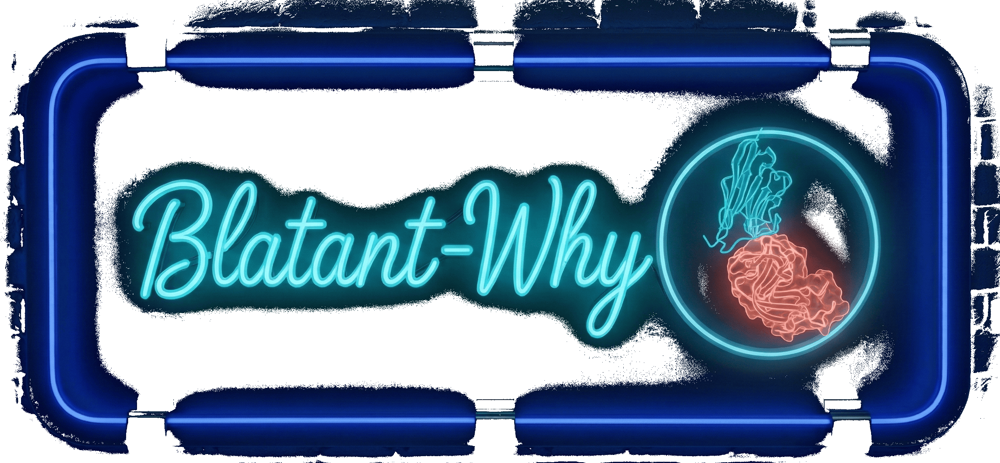
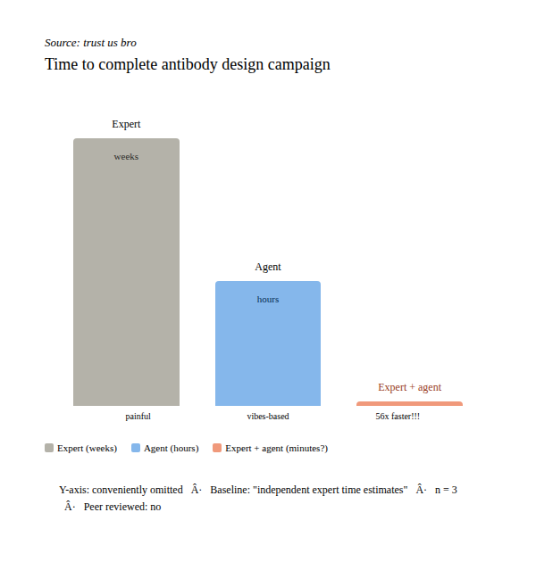

<p align="center">
  
</p>
<p align="center"><sub>Full-resolution banner: <a href="assets/">assets/</a></sub></p>

<p align="center">
  <a href="LICENSE"></a>
  <a href="https://github.com/001TMF/blatant-why/pulls"></a>
  
  
  
</p>

An autonomous antibody design agent that connects the Claude Code SDK, BoltzGen, Tamarind Bio, and Adaptyv Bio into a single pipeline. Give it a target. Get lab-ready nanobody candidates. No platform fee.

---

<p align="center">
  
</p>
<p align="center"><sub>Source: trust us bro</sub></p>
<p align="center"><sub>(Interactive version: <a href="assets/blatant_why_time_parody_v4.html">assets/blatant_why_time_parody_v4.html</a>)</sub></p>

---

## Why?

Because this morning someone announced an "autonomous AI agent for drug design" that wraps open-source structure prediction models in an LLM agent and calls it a breakthrough.

When your "proprietary scoring engine" is open-source structure prediction with a wrapper, and your "autonomous design platform" is an LLM calling APIs that anyone can call -- maybe the revolution isn't what you're selling.

The antibody discovery community deserves to know: **the agentic orchestration layer is not the hard part.** The models are open. The APIs are available. A good engineer can wire this together in a week.

So someone did. And gave it away.

**Stop paying for wrappers. Start asking what's underneath.**

---

## Quick Start

```bash
npx by-design init
claude
> "Design VHH nanobodies against PD-L1"
```

That's it. `by-design init` generates everything Claude Code needs -- MCP servers, agents, skills, commands, hooks, and a CLAUDE.md personality file. Open Claude Code in the same directory and you have a protein design workstation.

**Prerequisites:** [Claude Code](https://docs.anthropic.com/en/docs/claude-code), [uv](https://docs.astral.sh/uv/), Python >= 3.11, Node.js >= 18.

---

## What's Inside

- **11 MCP servers** -- biological databases, cloud compute, screening, campaign management, knowledge
- **16 agents** -- specialized sub-agents for research, design, screening, evaluation, and lab integration
- **15 skills** -- BoltzGen, Protenix, PXDesign, scoring, screening, epitope analysis, campaign management
- **8 slash commands** -- campaign control from the Claude Code prompt
- **ChromaDB learning system** -- semantic memory that improves with every campaign
- **Tamarind Bio cloud compute** -- free tier, 200+ structural biology models, no GPU required

<details>
<summary><strong>MCP Servers (11)</strong></summary>

| Server | Role |
|--------|------|
| `pdb` | Protein Data Bank queries |
| `uniprot` | UniProt protein annotation |
| `sabdab` | Structural Antibody Database |
| `by-screening` | Screening battery orchestration |
| `tamarind` | Tamarind Bio cloud compute |
| `levitate` | Levitate Bio RFAntibody pipeline |
| `adaptyv` | Adaptyv Bio lab submission (gated) |
| `by-campaign` | Campaign state management |
| `by-research` | Literature and target research |
| `by-local` | Local GPU compute dispatch |
| `by-knowledge` | ChromaDB semantic memory |

</details>

<details>
<summary><strong>Agents (16)</strong></summary>

| Agent | Role |
|-------|------|
| `by-research` | Target analysis, literature review, prior art |
| `by-design` | Generate designs via cloud or local pipelines |
| `by-screening` | Score, filter, rank candidates |
| `by-evaluator` | Structural evaluation and quality assessment |
| `by-visualization` | Structure and results visualization |
| `by-diversity` | Sequence and structural diversity selection |
| `by-campaign` | Campaign lifecycle orchestration |
| `by-knowledge` | Learning system and semantic memory |
| `by-verifier` | Output verification and sanity checks |
| `by-plan-checker` | Campaign plan validation |
| `by-environment` | Environment setup and dependency checks |
| `by-lab` | Adaptyv Bio lab submission (triple-gated) |
| `by-epitope` | Epitope analysis and mapping |
| `by-humanization` | Antibody humanization engineering |
| `by-liability-engineer` | Sequence liability detection and fixes |
| `by-formatter` | Output formatting and reporting |

</details>

<details>
<summary><strong>Skills (15)</strong></summary>

| Skill | Description |
|-------|-------------|
| `boltzgen` | BoltzGen antibody/nanobody generation |
| `protenix` | Protenix structure prediction |
| `pxdesign` | PXDesign de novo binder design |
| `proteus-scoring` | ipSAE + p_bind composite scoring |
| `proteus-screening` | Full screening battery |
| `proteus-epitope-analysis` | Epitope mapping and analysis |
| `proteus-campaign-manager` | Campaign state and lifecycle |
| `proteus-campaign-optimizer` | Active learning and iteration |
| `proteus-design-workflow` | End-to-end design pipeline |
| `proteus-research` | Target research and literature |
| `proteus-knowledge` | Semantic memory operations |
| `proteus-database` | Local results database |
| `proteus-failure-diagnosis` | Pipeline failure analysis |
| `proteus-hypothesis-debate` | Multi-agent hypothesis evaluation |
| `skill-creator` | Meta-skill for creating new skills |

</details>

<details>
<summary><strong>Slash Commands (8)</strong></summary>

| Command | Action |
|---------|--------|
| `/by:load` | Load a campaign from file |
| `/by:screen` | Run screening battery on designs |
| `/by:results` | Display campaign results table |
| `/by:watch` | Live-watch running compute jobs |
| `/by:status` | Campaign status dashboard |
| `/by:approve-lab` | Approve Adaptyv Bio submission (gated) |
| `/by:set-profile` | Switch compute profile |
| `/by:setup` | Initialize environment and dependencies |

</details>

<details>
<summary><strong>Repository Structure</strong></summary>

```
by-design/
├── assets/                  # Banner, diagrams, screenshots
├── campaigns/               # Campaign output directories
├── demo/                    # Headless demo runner (Claude Agent SDK)
├── docs/                    # Plans, specs, superpowers docs
├── examples/                # Example campaign configs
├── mcp_servers/             # 11 MCP server implementations
│   ├── adaptyv/             #   Adaptyv Bio lab submission
│   ├── campaign/            #   Campaign state management
│   ├── cloud/               #   Cloud compute abstraction
│   ├── knowledge/           #   ChromaDB semantic memory
│   ├── levitate/            #   Levitate Bio RFAntibody
│   ├── local_compute/       #   Local GPU dispatch
│   ├── pdb/                 #   Protein Data Bank
│   ├── research/            #   Literature & target research
│   ├── sabdab/              #   Structural Antibody Database
│   ├── screening/           #   Screening battery
│   ├── tamarind/            #   Tamarind Bio cloud compute
│   └── uniprot/             #   UniProt protein annotation
├── src/                     # Source code
│   ├── init-cli/            #   `npx by-design init` CLI
│   ├── proteus_cli/         #   Python CLI (scoring, screening, campaign)
├── templates/               # Templates deployed by init CLI
│   ├── .claude/             #   Agents, commands, hooks, skills, settings
│   └── mcp_servers/         #   MCP server templates
├── tests/                   # Test suite
├── CLAUDE.md                # Agent personality & orchestration rules
├── package.json             # Node.js package (Claude Agent SDK)
├── pyproject.toml           # Python package (uv)
└── README.md
```

</details>

---

## Architecture

```mermaid
graph TB
    User([fa:fa-user User]) -->|prompt| Claude[Claude Code + CLAUDE.md]

    Claude -->|delegates| Agents[16 Specialized Agents]
    Claude -->|invokes| Skills[15 Skills]
    Claude -->|slash cmds| Commands[8 Commands]

    Agents --> MCP[11 MCP Servers]
    Skills --> MCP

    subgraph Data Sources
        PDB[(PDB)]
        UniProt[(UniProt)]
        SAbDab[(SAbDab)]
    end

    subgraph Compute
        Tamarind[Tamarind Bio<br/>Free Cloud]
        Levitate[Levitate Bio<br/>RFAntibody]
        LocalGPU[Local GPU<br/>Optional]
    end

    subgraph Models
        BoltzGen[BoltzGen<br/>Ab/Nb Design]
        Protenix[Protenix v1<br/>Structure Prediction]
        PXDesign[PXDesign<br/>Binder Design]
    end

    subgraph Screening
        ipSAE[ipSAE Scoring]
        Liabilities[Liability Scan]
        Developability[Developability]
        Diversity[Diversity Selection]
    end

    subgraph Lab
        Adaptyv[Adaptyv Bio<br/>Triple-Gated]
    end

    MCP --> Data Sources
    MCP --> Compute
    Compute --> Models
    MCP --> Screening
    MCP --> Lab

    ChromaDB[(ChromaDB<br/>Learning System)] <--> MCP
```

<details>
<summary><strong>Model Profiles</strong></summary>

| Model | Type | Parameters | What It Does |
|-------|------|-----------|--------------|
| **Protenix v1** | Structure prediction | 368M | AlphaFold3-class folding (protein, nucleic acid, ligand) |
| **PXDesign** | De novo binder design | -- | 17-82% hit rates on published benchmarks |
| **BoltzGen** | Antibody/nanobody design | -- | Boltzmann generator + Protenix confidence scoring |

</details>

<details>
<summary><strong>Learning System</strong></summary>

Every campaign writes results to a ChromaDB vector store. The knowledge MCP server provides semantic search over past campaigns, so the system learns which design strategies work for which target classes.

Stored per campaign:
- Target metadata and research context
- Design parameters and compute profiles
- Screening results and composite scores
- Success/failure annotations

Over time, the agent develops institutional memory about what works.

</details>

---

## Credits

**Built by** [Tristan Farmer](https://www.linkedin.com/in/tristan-farmer-973b7a17a/)

- [Hannes Stark](https://github.com/jostorge/boltzgen) and the MIT team for BoltzGen
- [Deniz Kavi](https://tamarind.bio) and Sherry Liu at Tamarind Bio
- [Julian Englert](https://www.adaptyvbio.com) at Adaptyv Bio
- The [Anthropic Claude](https://docs.anthropic.com/en/docs/claude-code) team

---

## License

[MIT](LICENSE)
