<div align="center">

```
 ██████╗ ██████╗  ██████╗ ████████╗███████╗██╗   ██╗███████╗
 ██╔══██╗██╔══██╗██╔═══██╗╚══██╔══╝██╔════╝██║   ██║██╔════╝
 ██████╔╝██████╔╝██║   ██║   ██║   █████╗  ██║   ██║███████╗
 ██╔═══╝ ██╔══██╗██║   ██║   ██║   ██╔══╝  ██║   ██║╚════██║
 ██║     ██║  ██║╚██████╔╝   ██║   ███████╗╚██████╔╝███████║
 ╚═╝     ╚═╝  ╚═╝ ╚═════╝    ╚═╝   ╚══════╝ ╚═════╝ ╚══════╝
```

**AI-Powered Biologics Design Campaign Agent**

</div>

<p align="center">
  <a href="LICENSE"></a>
  <a href="https://nodejs.org/">= 18"></a>
  <a href="https://www.python.org/">= 3.10"></a>
  <a href="https://docs.anthropic.com/en/docs/claude-code"></a>
  
  <a href="https://github.com/001TMF/proteus-agent/pulls"></a>
</p>

<p align="center">
Design antibodies, nanobodies, de novo protein binders, and peptides from target to lab in one conversation. Proteus orchestrates multi-agent biologics design campaigns with BoltzGen, PXDesign, Protenix, and 200+ cloud tools -- from literature research through experimental validation.
</p>

<p align="center">
  
</p>

---

## What Makes Proteus Different

Proteus is not a chatbot with tool access. It is a multi-agent campaign system that coordinates the entire biologics design lifecycle autonomously -- from antibodies and nanobodies to de novo protein binders.

| Capability | What It Means |
|---|---|
| **Multi-agent orchestration** | 8 specialized agents (research, design, screening, lab, monitor, director, hypothesis, reflection) collaborate on each campaign |
| **Hypothesis debate** | Three competing strategy agents argue epitope selection, scaffold choice, and parameters before a reflection agent picks the winner -- inspired by Google's AI Co-Scientist |
| **8-phase research** | Quick / Standard / Deep / UltraDeep target research with quality gates, anti-drift checkpoints, and persistent memory. Works for any protein target. |
| **Active learning** | A random-forest optimizer analyzes scored designs after each round and recommends parameter changes for the next (EVOLVEpro-inspired) |
| **Statistical failure diagnosis** | Mann-Whitney U tests identify which features discriminate passed vs failed designs, with concrete threshold recommendations |
| **Knowledge graph** | Persistent structured memory across campaigns -- targets, scaffolds, failure patterns, and design outcomes carry forward |
| **Triple-gated lab safety** | Three independent layers prevent accidental lab submissions (TUI gate, one-time confirmation code, explicit CONFIRM) |
| **Full audit trail** | Conversation logs, decision JSONL, reproducibility manifests, and design exports (FASTA/CSV/campaign summary) |

## Features

<table>
<tr>
<td width="25%" valign="top">

**Design**

VHH nanobodies, scFv antibodies, de novo protein binders, and peptides. BoltzGen diffusion + PXDesign miniproteins + Protenix refolding. 7 VHH + 14 Fab scaffold templates. Fab-to-scFv conversion via (G4S)3 linker.

</td>
<td width="25%" valign="top">

**Research**

8-phase pipeline with 4 depth modes. PubMed, bioRxiv, PDB, UniProt, SAbDab wired in. Cross-species homolog search for novel targets. SAbDab novelty/IP checking.

</td>
<td width="25%" valign="top">

**Screening**

13 tools: ipSAE, ipTM, pLDDT, RMSD, liabilities, developability, naturalness, diversity, shape complementarity, alignment, failure diagnosis, cross-validation, Pareto front.

</td>
<td width="25%" valign="top">

**Campaign Management**

4 tiers (preview to exploratory). Active learning iteration. Decision logging. Cost tracking. Design export. Multi-round compare. Background job enforcement.

</td>
</tr>
<tr>
<td width="25%" valign="top">

**Compute**

Tamarind Bio (200+ models, free tier). Levitate Bio (RFAntibody). Local GPU (Protenix, PXDesign, BoltzGen). SSH remote GPU. Auto-detect from env vars.

</td>
<td width="25%" valign="top">

**Lab Integration**

Adaptyv Bio wet-lab testing. Triple-layer safety gate. Cost estimation before submission. $119-215/variant, 2-4 week turnaround.

</td>
<td width="25%" valign="top">

**Hypothesis Debate**

3 competing strategy agents + 1 reflection agent. Adversarial ranking before committing GPU compute. Decision logged to JSONL audit trail.

</td>
<td width="25%" valign="top">

**TUI**

Ink/React terminal interface. 16 slash commands. 3 modes (Binder/Antibody/Structure). Pipeline watch. Desktop notifications. Conversation export.

</td>
</tr>
</table>

## Quick Start

```bash
git clone https://github.com/001TMF/blatant-why.git
cd blatant-why
chmod +x setup.sh && ./setup.sh
cd harness && npm run dev
```

On first launch, Proteus detects available compute providers from your `.env` and configures itself automatically. No Tamarind key? It will prompt you -- the free tier gives 10 jobs/month, enough to run a preview campaign.

## Design Modalities

| Modality | Engine | Protocol | Scaffolds | Typical Designs | Use Case |
|---|---|---|---|---|---|
| **VHH nanobody** | BoltzGen | `nanobody-anything` | caplacizumab, ozoralizumab, vobarilizumab, gefurulimab + 3 more | 500--50K | Small, stable single-domain binders. Ideal for imaging, diagnostics, and bispecifics. |
| **scFv antibody** | BoltzGen | `antibody-anything` | adalimumab, dupilumab, nirsevimab, tezepelumab + 10 more Fab templates | 500--50K | Traditional antibody variable fragments. Fab-to-scFv conversion via (G4S)3 linker. IgG-convertible. |
| **De novo binder** | PXDesign | `extended` preset | N/A (designed from scratch) | 500--50K | Miniprotein binders with no immunoglobulin scaffold. 17--82% experimental hit rates. |

All modalities feed into the same screening pipeline and can be mixed within a single campaign.

## Campaign Tiers

| Tier | Compute Cost | Designs | Refolded | Lab Candidates | Best For |
|---|---|---|---|---|---|
| **Preview** | ~$5 | 500 | 10 | -- | Quick feasibility check |
| **Standard** | ~$35/scaffold | 5,000 | 100 | 10--20 | Well-studied targets |
| **Production** | ~$140/scaffold | 20,000 | 500 | 20--50 | Serious campaigns, multiple scaffolds |
| **Exploratory** | ~$350/scaffold | 50,000 | 2,000 | 50+ | Novel targets, maximum diversity |

Costs are compute only (Tamarind + Protenix refolding). Lab testing via Adaptyv Bio is additional ($119--215/variant, 2--4 week turnaround).

## Architecture

```mermaid
graph TD
    User([User]) --> TUI[Proteus TUI<br/>Ink/React + Claude Code SDK]
    TUI --> Orch[Campaign Orchestrator]

    Orch --> RA[Research Agent]
    Orch --> DA[Design Agent]
    Orch --> SA[Screening Agent]
    Orch --> LA[Lab Agent]
    Orch --> MA[Monitor]
    Orch --> DB[Debate Team]
    Orch --> REF[Reflection Agent]

    DB --> HE[Hypothesis: Epitope]
    DB --> HS[Hypothesis: Scaffold]
    DB --> HP[Hypothesis: Parameters]

    RA --> PDB[(PDB)]
    RA --> UP[(UniProt)]
    RA --> SAB[(SAbDab)]
    RA --> RES[(PubMed<br/>bioRxiv)]
    RA --> KG[(Knowledge<br/>Graph)]

    DA --> TAM[Tamarind Bio<br/>BoltzGen + 200 models]
    DA --> LEV[Levitate Bio<br/>RFAntibody]
    DA --> LOCAL[Local / SSH GPU]

    SA --> SCR[Screening MCP<br/>13 tools]
    SA --> CV[Cross-Validation<br/>Multi-seed ipSAE]
    SA --> PAR[Pareto Front<br/>Multi-objective]

    LA --> ADT[Adaptyv Bio<br/>Lab Testing]

    MA --> CS[(Campaign State)]

    style TUI fill:#4CAF50,stroke:#333,color:#fff
    style Orch fill:#2E7D32,stroke:#333,color:#fff
    style RA fill:#1A1A2E,stroke:#4CAF50,color:#66BB6A
    style DA fill:#1A1A2E,stroke:#4CAF50,color:#66BB6A
    style SA fill:#1A1A2E,stroke:#4CAF50,color:#66BB6A
    style LA fill:#1A1A2E,stroke:#E53935,color:#EF9A9A
    style MA fill:#1A1A2E,stroke:#4CAF50,color:#66BB6A
    style DB fill:#1A1A2E,stroke:#FF9800,color:#FFE0B2
    style REF fill:#1A1A2E,stroke:#FF9800,color:#FFE0B2
    style HE fill:#263238,stroke:#FF9800,color:#FFE0B2
    style HS fill:#263238,stroke:#FF9800,color:#FFE0B2
    style HP fill:#263238,stroke:#FF9800,color:#FFE0B2
    style KG fill:#263238,stroke:#66BB6A,color:#A5D6A7
    style TAM fill:#263238,stroke:#66BB6A,color:#A5D6A7
    style LEV fill:#263238,stroke:#66BB6A,color:#A5D6A7
    style LOCAL fill:#263238,stroke:#66BB6A,color:#A5D6A7
    style ADT fill:#263238,stroke:#E53935,color:#EF9A9A
    style SCR fill:#263238,stroke:#66BB6A,color:#A5D6A7
    style CV fill:#263238,stroke:#66BB6A,color:#A5D6A7
    style PAR fill:#263238,stroke:#66BB6A,color:#A5D6A7
```



## Agent Team

| Agent | Role | MCP Servers | Purpose |
|---|---|---|---|
| **Research** | Target intelligence | pdb, uniprot, sabdab, research, knowledge | Gather target structure, known binders, epitope data, and prior art. Persist findings to knowledge graph. |
| **Design** | Binder generation | pdb, screening, tamarind, levitate, campaign | Submit and monitor BoltzGen / PXDesign compute jobs |
| **Screening** | Computational triage | screening, campaign, knowledge, tamarind | Score, filter, rank, and diagnose designs. Run Pareto analysis and cross-validation. |
| **Lab Integration** | Wet-lab bridge | adaptyv | Prepare and submit candidates to Adaptyv Bio (triple-gated) |
| **Monitor** | Job tracking | tamarind, levitate, campaign | Poll compute jobs, update campaign state, report progress |
| **Campaign Director** | Orchestration | campaign | Manage campaign lifecycle, cost tracking, iteration decisions |
| **Hypothesis (x3)** | Strategy proposals | pdb, uniprot, sabdab, research, campaign | Three parallel agents propose competing strategies for epitope, scaffold, and parameters |
| **Reflection** | Strategy selection | campaign | Critique, rank, and select the winning hypothesis. Log decision rationale. |

## MCP Servers

Proteus exposes 11 MCP servers, each wrapping a focused set of tools:

| Server | Tools | Description |
|---|---|---|
| `proteus-pdb` | `pdb_search`, `pdb_fetch_structure`, `pdb_get_chains`, `pdb_interface_residues`, `pdb_download` | RCSB PDB structure search and analysis |
| `proteus-uniprot` | `uniprot_search`, `uniprot_fetch_protein`, `uniprot_get_domains`, `uniprot_get_variants` | UniProt protein metadata and annotations |
| `proteus-sabdab` | `sabdab_search` | SAbDab antibody structure database -- novelty/IP checking |
| `proteus-screening` | `screen_liabilities`, `screen_developability`, `screen_net_charge`, `score_ipsae`, `score_ipsae_multi_seed`, `screen_composite`, `interpret_scores`, `screen_diversity`, `screen_diagnose_failures`, `screen_pareto_front`, `screen_align_sequences`, `screen_shape_complementarity`, `screen_naturalness` | 13 screening and scoring tools |
| `proteus-tamarind` | `tamarind_list_models`, `tamarind_submit_job`, `tamarind_get_job_status`, `tamarind_get_job_results`, `tamarind_wait_for_job` | Tamarind Bio cloud compute (200+ models) |
| `proteus-levitate` | `levitate_list_pipelines`, `levitate_run_rfantibody`, `levitate_run_analysis`, `levitate_get_results`, `levitate_estimate_cost` | Levitate Bio alternative compute |
| `proteus-adaptyv` | `adaptyv_estimate_cost`, `adaptyv_prepare_submission`, `adaptyv_confirm_submission`, `adaptyv_get_experiment_status`, `adaptyv_get_results` | Adaptyv Bio lab integration (triple-gated) |
| `proteus-campaign` | `campaign_create`, `campaign_get`, `campaign_update_status`, `campaign_add_round`, `campaign_update_round`, `campaign_record_scores`, `campaign_get_summary`, `campaign_get_cost_estimate` | Campaign state management and cost tracking |
| `proteus-research` | `research_search_prior_art`, `research_get_target_info`, `research_analyze_known_binders`, `research_find_similar_targets` | Literature and prior art aggregation |
| `proteus-local` | `local_detect_tools`, `local_detect_gpu`, `local_run_boltzgen`, `local_run_pxdesign`, `local_run_protenix`, `ssh_detect_tools_remote`, `ssh_detect_gpu_remote`, `ssh_run_job` | Local GPU and SSH remote compute |
| `proteus-knowledge` | `knowledge_add_entity`, `knowledge_add_relationship`, `knowledge_query`, `knowledge_get_entities` | Persistent knowledge graph across campaigns |

## Screening Pipeline

Every design passes through a multi-stage computational funnel before reaching lab consideration:

```
  50,000 designs (exploratory tier)
      |
      v
  +------------+
  | BoltzGen   |  Guided diffusion over CDR sequences
  | / PXDesign |  or de novo miniprotein backbone generation
  +-----+------+
        |
        v
  +------------+
  | Protenix   |  AF3-class structure prediction (368M params)
  | Refolding  |  Multi-seed for antibodies (20+ seeds)
  +-----+------+
        |
        v
  2,000 refolded structures
        |
        +-- ipTM > 0.5            Hard structural confidence filter
        +-- ipSAE > 0.3           Custom TM-align interface score (DunbrackLab)
        +-- pLDDT > 70            Per-residue confidence
        +-- RMSD < 5.0 A          Structural deviation
        |
        v
  +---------------+
  | Liabilities   |  NG/NS deamidation, DG isomerization, Met oxidation,
  |               |  free Cys, NXS/T glycosylation
  +------+--------+
         |
         v
  +----------------+
  | Developability |  Net charge (pH 7.4), CDR length, hydrophobic fraction,
  |                |  TAP guidelines, composition flags
  +------+---------+
         |
         v
  +----------------+
  | Naturalness    |  AbLang2 pseudo-perplexity, human germline distance,
  |                |  framework conservation
  +------+---------+
         |
         v
  +----------------+
  | Shape Comp.    |  Geometric interface complementarity between
  |                |  binder and target surfaces
  +------+---------+
         |
         v
  +----------------+
  | Diversity      |  Sequence identity clustering, CDR3 diversity,
  |                |  structural diversity via RMSD matrix
  +------+---------+
         |
         v
  +---------------------+
  | Cross-Validation    |  Multi-seed ipSAE aggregation (20 seeds)
  |                     |  Confidence intervals for top candidates
  +------+--------------+
         |
         v
  +---------------------+
  | Failure Diagnosis   |  Mann-Whitney U tests on pass/fail split
  |                     |  Top discriminating features + recommendations
  +------+--------------+
         |
         v
  +---------------------+
  | Pareto Front        |  Multi-objective ranking (ipSAE vs diversity
  |                     |  vs developability). Non-dominated solutions.
  +------+--------------+
         |
         v
  15-20 candidates --> Lab (Adaptyv Bio)
```

## Slash Commands

| Command | Description |
|---|---|
| `/help` | Show available commands |
| `/campaign` | Start or resume a design campaign |
| `/resume` | Resume a previous campaign with full context restoration |
| `/status` | Current campaign status |
| `/results` | Show ranked design results |
| `/screen` | Run screening battery on a design |
| `/watch` | Watch live pipeline progress |
| `/load` | Load a target protein (PDB ID, UniProt ID, or name) |
| `/compare` | Compare metrics across campaign rounds |
| `/pareto` | Show Pareto-optimal designs (multi-objective trade-offs) |
| `/jobs` | Show active cloud compute jobs |
| `/approve-lab` | Approve lab submission (requires CONFIRM) |
| `/costs` | Show campaign cost breakdown |
| `/team` | Show active agent team status |
| `/export` | Export conversation log (markdown or csv) |
| `/mode` | Show/switch mode (Binder / Antibody / Structure) |

## Advanced Features

### Hypothesis-Debate (Co-Scientist Pattern)

For novel targets or ambiguous design choices, Proteus spawns three parallel hypothesis agents -- one focused on epitope region selection, one on scaffold and protocol choice, and one on BoltzGen parameters and campaign sizing. Each agent independently proposes a strategy backed by literature evidence. A fourth reflection agent then critiques all three proposals, ranks them adversarially, and selects the winner. The winning strategy becomes the campaign configuration. All decisions are logged to `decision_log.jsonl` with full rationale.

Triggers automatically for novel targets (0-1 PDB structures, no known binders) or contradictory research findings. Skipped for preview campaigns and well-studied targets where the optimal approach is clear.

### Active Learning Campaign Optimizer

After each design round, a random-forest regressor (100 trees, max depth 5) trains on all scored designs to predict ipSAE as the optimization target. Feature importances identify which parameters matter most. Top-quartile analysis derives concrete threshold recommendations for the next round -- tighter ipTM filters, adjusted alpha values, or different scaffold emphasis. Falls back to rule-based recommendations when fewer than 10 designs are scored. Inspired by the EVOLVEpro approach to iterative protein engineering.

### Knowledge Graph

A persistent structured memory that spans campaigns. Entities (targets, epitopes, scaffolds, designs, screen results, failure patterns) and their relationships are stored as JSONL files in `~/.proteus/knowledge/`. When starting a new campaign against a target that was studied before, the knowledge graph surfaces previous scaffold performance, known failure modes, and optimal parameter ranges. Queries support `scaffolds_for_target`, `failure_patterns`, and `best_parameters` lookups.

### Failure Diagnosis

When a campaign's screening pass rate drops below 20%, the failure diagnosis system activates. It runs Mann-Whitney U tests comparing passed vs failed designs across all continuous metrics (ipSAE, ipTM, pLDDT, RMSD, liabilities, net charge, hydrophobic fraction, CDR3 length). Features are ranked by effect size and p-value. The system produces concrete recommendations: "Increase ipSAE threshold to 0.45" or "Switch from ozoralizumab scaffold (12% pass rate) to caplacizumab (38% pass rate)."

### Multi-Seed ipSAE Validation

For antibody campaigns, top candidates are validated with 20+ Protenix seeds. The multi-seed aggregation reports mean, standard deviation, and confidence intervals for ipSAE, filtering out designs that score well on a single seed but poorly on average. This catches false positives from stochastic structure prediction before committing to lab testing.

## Lab Safety Gate

Lab submissions to Adaptyv Bio are protected by a triple-layer safety gate. No accidental or unauthorized submissions are possible.

| Layer | Mechanism | What It Prevents |
|---|---|---|
| **1. TUI gate** | User must type `/approve-lab` in the terminal | Agent cannot autonomously initiate submissions |
| **2. Confirmation code** | `adaptyv_prepare_submission` returns a one-time code valid for 5 minutes | Stale or replayed submissions |
| **3. Explicit confirm** | User must type `CONFIRM` with the exact code to execute `adaptyv_confirm_submission` | Accidental approval |

Cost estimates via `adaptyv_estimate_cost` are always safe to run -- they never trigger a submission.

## Campaign Cost Reference

Based on real-world biologics design economics ([Asimov Press](https://press.asimov.com/)):

| Campaign Type | Compute | Lab Testing | Total |
|---|---|---|---|
| **Minimum viable** | ~$500 (10K designs, 100 refolded) | ~$3,500 (10 variants x $175 + $1,750 setup) | **~$4,000** |
| **Standard full** | ~$2,000 (50K designs, 500 refolded) | ~$14,000 (50 variants x $175 + $5,250 setup) | **~$16,000** |
| **Production** | ~$4,000 (100K designs, 2K refolded) | ~$15,000 (50 variants x $215 + $4,250 setup) | **~$19,000** |

Success rates are highly target-dependent (1--89% in literature). Well-studied targets with known epitopes have the best odds.

## Configuration

Campaigns are defined in YAML. Here is a real example for anti-TNF-alpha VHH nanobodies:

```yaml
name: "tnfa_vhh_standard"
tier: "standard"
target_difficulty: "well-studied"

target:
  name: "TNF-alpha"
  pdb_id: "1TNF"
  chain_id: "A"
  uniprot_id: "P01375"

epitope:
  hotspot_residues: [75, 76, 77, 79, 81, 87, 88, 89, 90, 91, 92, 95, 96, 97, 133, 135, 136, 137]
  region_notation: "75..97,133..137"

design:
  tool: "boltzgen"
  modality: "vhh"
  protocol: "nanobody-anything"
  scaffolds:
    - name: "caplacizumab"
      pdb: "7eow"
    - name: "ozoralizumab"
      pdb: "8z8v"
  designs_per_scaffold: 5000
  alpha: 0.001
  budget: 50

screening:
  hard_filters:
    iptm_min: 0.5
    ipsae_min: 0.3
    plddt_min: 70
    rmsd_max: 5.0
  ranking_weights:
    ipsae_min: 0.50
    iptm: 0.30
    liability_penalty: 0.20

lab:
  max_candidates: 20
  cost_per_variant_usd: 175
  provider: "adaptyv_bio"

compute:
  provider: "tamarind"
  gpu_type: "A100"
```

## Environment Variables

```bash
# ---- Claude Code (REQUIRED) -------------------------------------------------
# Proteus runs on top of Claude Code. Install and authenticate first:
#   npm install -g @anthropic-ai/claude-code
#   claude auth login
# No API key needed here -- Proteus uses your Claude Code session.

# ---- Cloud Compute (Tamarind Bio -- DEFAULT) ---------------------------------
# Free tier: 10 jobs/month. Get your key at https://app.tamarind.bio
TAMARIND_API_KEY=

# ---- Cloud Compute (Levitate Bio -- alternative) -----------------------------
# Get credentials at https://levitate.bio
LEVITATE_CLIENT_ID=
LEVITATE_CLIENT_SECRET=

# ---- Lab Testing (Adaptyv Bio -- REQUIRES /approve-lab) ----------------------
# Get your token at https://www.adaptyvbio.com
ADAPTYV_API_TOKEN=

# ---- Local GPU (power users) ------------------------------------------------
# Set tool paths for local GPU execution
# PROTEUS_FOLD_DIR=/path/to/Protenix
# PROTEUS_PROT_DIR=/path/to/PXDesign
# PROTEUS_AB_DIR=/path/to/boltzgen

# ---- SSH Remote GPU ----------------------------------------------------------
# Run designs on a remote GPU server via SSH
# PROTEUS_SSH_HOST=gpu-server.example.com
# PROTEUS_SSH_USER=researcher
# PROTEUS_SSH_PORT=22
# PROTEUS_SSH_KEY=~/.ssh/id_rsa
# PROTEUS_SSH_TOOLS_PATH=/opt/proteus
# PROTEUS_SSH_WORKSPACE=/tmp/proteus
```

Only `TAMARIND_API_KEY` is required to get started. The free tier is sufficient for preview campaigns. Proteus auto-detects available providers on launch.

## Project Structure

```
proteus/
├── harness/                          # TypeScript TUI (Ink/React)
│   └── src/
│       ├── index.ts                  # Entry point
│       ├── app.tsx                   # Main React component
│       ├── agent.ts                  # Claude Code SDK integration
│       ├── banner.ts                 # ASCII banner
│       ├── theme.ts                  # Green terminal theme (#4CAF50)
│       ├── slashCommands.ts          # 16 slash commands
│       ├── conversationLog.ts        # Conversation export
│       ├── watchRun.ts               # Pipeline progress tracking
│       ├── modes.ts                  # Binder / Antibody / Structure modes
│       ├── agents/                   # Agent team system
│       │   ├── definitions/          # 8 agent types (research, design, screening,
│       │   │                         #   lab, debate x3, reflection)
│       │   ├── orchestrator.ts       # Multi-agent coordination
│       │   ├── monitor.ts            # Job monitoring
│       │   ├── costTracker.ts        # Cost estimation
│       │   └── types.ts             # Agent type definitions
│       ├── components/               # UI components
│       │   ├── AgentTeamStatus.tsx   # Agent team display
│       │   ├── CostSummary.tsx       # Cost breakdown
│       │   ├── LabApproval.tsx       # Lab safety gate UI
│       │   ├── PipelineWatch.tsx     # Live pipeline progress
│       │   ├── ScrollableOutput.tsx  # Scrollable text output
│       │   ├── MarkdownText.tsx      # Markdown rendering
│       │   └── Spinner.tsx           # Loading indicator
│       └── hooks/                    # React hooks
│           ├── useCampaignState.ts   # Campaign state management
│           ├── useInputHistory.ts    # Input history
│           └── useTerminalSize.ts    # Terminal dimensions
├── src/
│   └── proteus_cli/                  # Python CLI + screening library
│       ├── main.py                   # CLI entry point
│       ├── common.py                 # Shared utilities
│       ├── fold.py                   # Protenix wrapper
│       ├── protein.py                # PXDesign wrapper
│       ├── antibody.py               # BoltzGen wrapper
│       ├── ssh_runner.py             # SSH remote execution
│       ├── scoring/                  # Custom scoring
│       │   └── ipsae.py              # ipSAE (DunbrackLab formula)
│       ├── screening/                # 9 screening modules
│       │   ├── alignment.py          # Sequence alignment
│       │   ├── developability.py     # TAP guidelines
│       │   ├── diagnosis.py          # Failure root cause analysis
│       │   ├── diversity.py          # Sequence/structural diversity
│       │   ├── liabilities.py        # Chemical liability detection
│       │   ├── naturalness.py        # Germline distance, perplexity
│       │   ├── pareto.py             # Multi-objective Pareto front
│       │   └── shape_complementarity.py  # Interface geometry
│       └── campaign/                 # Campaign management
│           ├── active_learning.py    # RF-based optimizer
│           ├── config.py             # YAML config parsing
│           ├── cost.py               # Cost estimation
│           ├── decisions.py          # Decision logging (JSONL)
│           ├── defaults.py           # Tiers, scaffolds, protocols
│           ├── export.py             # FASTA/CSV/summary export
│           ├── funnel.py             # Screening funnel tracking
│           ├── iteration.py          # Multi-round iteration
│           ├── state.py              # Campaign state machine
│           └── visualization.py      # PyMOL/ChimeraX scripts
├── mcp_servers/                      # 11 MCP servers (FastMCP)
│   ├── pdb/                          # RCSB PDB
│   ├── uniprot/                      # UniProt
│   ├── sabdab/                       # SAbDab
│   ├── screening/                    # 13 screening tools
│   ├── tamarind/                     # Tamarind Bio cloud compute
│   ├── levitate/                     # Levitate Bio compute
│   ├── adaptyv/                      # Adaptyv Bio lab
│   ├── campaign/                     # Campaign state
│   ├── research/                     # Literature search
│   ├── local_compute/                # Local + SSH GPU
│   ├── knowledge/                    # Knowledge graph
│   └── _shared/                      # Shared server utilities
├── .claude/
│   └── skills/                       # 15 Claude Code skills
│       ├── boltzgen/                 # BoltzGen CLI + protocols
│       ├── protenix/                 # Protenix CLI + seeds
│       ├── pxdesign/                 # PXDesign CLI + presets
│       ├── proteus-design-workflow/  # Master orchestration
│       ├── proteus-scoring/          # ipSAE + composite scoring
│       ├── proteus-screening/        # Screening battery
│       ├── proteus-epitope-analysis/ # Interface + hotspot analysis
│       ├── proteus-campaign-manager/ # Campaign lifecycle
│       ├── proteus-campaign-optimizer/ # Active learning
│       ├── proteus-database/         # PDB/UniProt/SAbDab queries
│       ├── proteus-research/         # 8-phase research pipeline
│       ├── proteus-knowledge/        # Knowledge graph ontology
│       ├── proteus-hypothesis-debate/# Debate protocol
│       ├── proteus-failure-diagnosis/# Statistical failure analysis
│       └── skill-creator/            # Meta-skill for skill creation
├── examples/                         # Campaign config examples
│   ├── tnfa-vhh/                     # TNF-alpha nanobody campaign
│   ├── tnfa-vhh-local/              # Local GPU variant
│   ├── tnfa-vhh-ssh/                # SSH remote variant
│   └── pdl1-binder/                  # PD-L1 de novo binder
├── campaigns/                        # Active campaign data
├── tests/                            # Test suite
├── plugin-manifest.json              # Tool + server manifest
├── .env.example                      # Environment variable template
└── pyproject.toml                    # Python project config
```

## Screenshots

<p align="center">
  
</p>

<p align="center">
  
</p>

<p align="center">
  
</p>

## Contributing

Contributions are welcome. Here is how to get started:

1. Fork the repository
2. Create a feature branch (`git checkout -b feature/my-feature`)
3. Make your changes
4. Run `cd harness && npm run typecheck` to verify TypeScript
5. Run `pytest tests/` to verify Python
6. Open a pull request against `main`

Please open an issue first for major changes to discuss the approach.

## License

[MIT](LICENSE)

## Acknowledgments

- **[BoltzGen](https://github.com/jostorge/boltzgen)** (MIT) by Hannes Stark et al. -- stochastic optimal control for antibody design
- **[Protenix](https://github.com/bytedance/protenix)** by ByteDance -- AF3-class structure prediction (368M params)
- **[PXDesign](https://github.com/bytedance/pxdesign)** by ByteDance -- de novo protein binder design (17--82% hit rates)
- **[Tamarind Bio](https://tamarind.bio)** -- cloud compute platform with 200+ structural biology models
- **[Adaptyv Bio](https://www.adaptyvbio.com)** -- wet-lab antibody testing and validation
- **[Levitate Bio](https://levitate.bio)** -- cloud compute for RFAntibody and analysis pipelines
- **[DunbrackLab](https://dunbrack.fccc.edu/)** -- ipSAE formula (TM-align-inspired interface score from PAE matrices)
- **[AbLang2](https://github.com/oxpig/AbLang2)** -- antibody language model for naturalness scoring
- **[EVOLVEpro](https://github.com/AI4PDLab/EVOLVEpro)** -- active learning framework for iterative protein engineering
- **[Claude Code SDK](https://docs.anthropic.com/en/docs/claude-code)** by Anthropic -- agent framework powering the TUI
- **[BioPython](https://biopython.org/)** -- structural biology utilities

## Citation

If Proteus is useful in your research, you can cite it as:

```bibtex
@software{proteus2026,
  title   = {Proteus: AI-Powered Biologics Design Campaign Agent},
  author  = {Tristan Farmer},
  year    = {2026},
  url     = {https://github.com/001TMF/blatant-why},
  license = {MIT}
}
```
