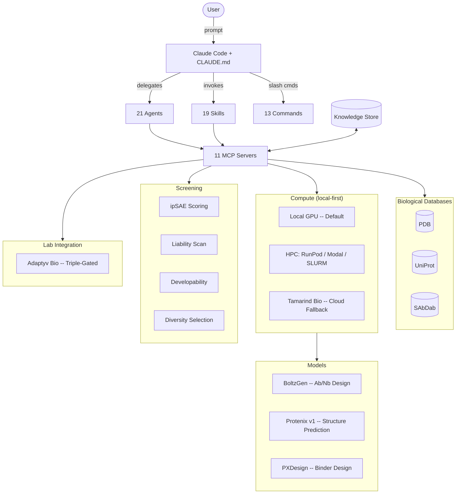

<p align="center">
  
</p>

<p align="center">
  
  <a href="LICENSE"></a>
  <a href="https://github.com/001TMF/blatant-why/pulls"></a>
  
  
  
</p>

<h3 align="center">Open-source protein design agent for Claude Code</h3>

<p align="center">
Commercial platforms wrap open-source tools behind paywalls and call it a revolution.<br>
BY gives you direct access through Claude Code. No platform fees. Your tools, your compute, your designs.
</p>

---

<p align="center">
  
</p>
<p align="center"><sub>Source: trust us bro</sub></p>

---

## Quick Start (5 minutes)

You don't need to be a developer. If you can open a terminal and paste commands, you can run BY.

### 1. Install prerequisites

| Tool | Install | Check |
|------|---------|-------|
| **Node.js 18+** | [nodejs.org](https://nodejs.org/) | `node --version` |
| **Python 3.11+** | [python.org](https://www.python.org/) | `python3 --version` |
| **uv** | `curl -LsSf https://astral.sh/uv/install.sh \| sh` | `uv --version` |
| **Claude Code** | `npm install -g @anthropic-ai/claude-code` | `claude --version` |

### 2. Create your project

```bash
mkdir my-campaign && cd my-campaign
npx blatant-why init
```

This scaffolds everything: 11 MCP servers, 21 agents, 19 skills, 13 slash commands, and a CLAUDE.md orchestration file. Takes about 30 seconds.

### 3. (Optional) Configure compute

BY defaults to **local GPU** if one is available. Otherwise the first-run questionnaire will help you pick between local, HPC (RunPod / Modal / SLURM), or Tamarind cloud. See *Compute Options* below.

```bash
cp .env.example .env
# Add keys for whichever compute provider you'll use
```

### 4. Start designing

```bash
claude
```

Then just tell it what you want:

```
> "Design VHH nanobodies against PD-L1"
```

Or use the guided workflow:

```
> /by:plan-campaign
```

Or if it's your first time:

```
> /by:welcome
```

That's it. Claude Code handles the rest -- research, design, screening, and ranking.

---

## What It Does

Give it a target protein. It researches across PDB, UniProt, and SAbDab. It plans a design campaign with statistical-strategy debate when the target is novel. It runs compute jobs on your local GPU (default), on your HPC (RunPod / Modal / SLURM via the `by-deploy-compute` skill), or on Tamarind Bio cloud. It screens every design for structural quality, sequence liabilities, and developability. It ranks candidates by composite score. When you submit them to the lab and the results come back, it ingests the CSVs, diagnoses which in-silico features predicted reality, and feeds the calibration back into the next round.

The whole pipeline runs inside Claude Code. No platform. No dashboard. No vendor lock-in.

---

## What's Inside

| Component | Count | Description |
|-----------|-------|-------------|
| MCP Servers | 11 | Biological databases, compute (local + HPC + cloud), screening, campaign state, knowledge store |
| Agents | 21 | Research, design, screening, evaluation, lab integration, prior-art, sequence/structure/epitope researchers |
| Skills | 19 | BoltzGen, Protenix, PXDesign, scoring, screening, campaign management, HPC deployment, wet-lab feedback, mechanistic reasoning |
| Slash Commands | 13 | Campaign control from the Claude Code prompt |

<details>
<summary><strong>MCP Servers (11)</strong></summary>

| Server | Role |
|--------|------|
| `pdb` | Protein Data Bank queries |
| `uniprot` | UniProt protein annotation |
| `sabdab` | Structural Antibody Database |
| `screening` | Screening battery orchestration |
| `tamarind` | Tamarind Bio cloud compute |
| `cloud` | Cloud compute abstraction |
| `adaptyv` | Adaptyv Bio lab submission (gated) |
| `campaign` | Campaign state management |
| `research` | Literature and target research |
| `local_compute` | Local GPU compute dispatch |
| `knowledge` | JSON-backed campaign knowledge store |

</details>

<details>
<summary><strong>Agents (21)</strong></summary>

| Agent | Role |
|-------|------|
| `by-research` | Target analysis, literature review, prior art (8-phase research pipeline) |
| `by-prior-art-researcher` | Prior-art deep dive for novel targets |
| `by-sequence-researcher` | Sequence-level analysis (orthologs, conservation, motifs) |
| `by-structure-researcher` | Structural analysis (PDB, AlphaFold, conformations) |
| `by-epitope-researcher` | Epitope-focused literature and structural research |
| `by-research-synthesizer` | Synthesize outputs from the research sub-agents |
| `by-design` | Generate designs via local, HPC, or cloud pipelines |
| `by-screening` | Score, filter, rank candidates |
| `by-evaluator` | Structural evaluation and quality assessment |
| `by-visualization` | Structure and results visualization |
| `by-diversity` | Sequence and structural diversity selection |
| `by-campaign` | Campaign lifecycle orchestration |
| `by-knowledge` | Learning system and campaign memory |
| `by-verifier` | Output verification and sanity checks |
| `by-plan-checker` | Campaign plan validation |
| `by-environment` | Environment setup and dependency checks |
| `by-lab` | Adaptyv Bio lab submission (triple-gated) |
| `by-epitope` | Epitope analysis and mapping |
| `by-humanization` | Antibody humanization engineering |
| `by-liability-engineer` | Sequence liability detection and fixes |
| `by-formatter` | Output formatting and reporting |

</details>

<details>
<summary><strong>Skills (19)</strong></summary>

| Skill | Category | Description |
|-------|----------|-------------|
| `boltzgen` | tool | BoltzGen antibody/nanobody generation |
| `protenix` | tool | Protenix structure prediction (AF3-class) |
| `pxdesign` | tool | PXDesign de novo binder design |
| `by-design-workflow` | orchestration | Tool routing + intent → preset matrix |
| `by-campaign-manager` | orchestration | Campaign state, checkpoints, cost model |
| `by-research` | research | 8-phase research pipeline with confidence tiers |
| `by-database` | research | PDB / UniProt / SAbDab lookups |
| `by-epitope-analysis` | research | Hotspot scoring + interface classification |
| `by-hypothesis-debate` | strategy | 3+1 agent topology for novel-target strategy selection |
| `by-scoring` | scoring | ipSAE algorithm + composite scoring |
| `by-screening` | filtering | Full screening battery, liability + developability rules |
| `by-failure-diagnosis` | analysis | Mann-Whitney U statistical failure analysis |
| `by-experiment-results` | analysis | **NEW.** Ingest lab CSV/Excel, diagnose in-silico vs lab divergence, close design → screen → lab → learn loop |
| `by-causal-reasoning` | analysis | **NEW.** Evidence-anchored mechanistic hypotheses from knowledge graph |
| `by-campaign-optimizer` | optimization | Active learning + RF feature importance |
| `by-knowledge` | persistence | Campaign knowledge graph (entities + relationships) |
| `by-session` | session | Session init, config questionnaire, resume protocol |
| `by-display` | display | Canonical output formats (banners, score bars, status tables) |
| `by-deploy-compute` | deployment | **NEW.** Deploy Protenix / BoltzGen / PXDesign on local GPU, RunPod, Modal, or SLURM |

See [`templates/.claude/skills/README.md`](templates/.claude/skills/README.md) for the canonical terminology table and full skill-linkage map.

</details>

<details>
<summary><strong>Slash Commands (11)</strong></summary>

| Command | Action |
|---------|--------|
| `/by:load` | Load a campaign from file |
| `/by:screen` | Run screening battery on designs |
| `/by:results` | Display campaign results table |
| `/by:watch` | Live-watch running compute jobs |
| `/by:status` | Campaign status dashboard |
| `/by:approve-lab` | Approve Adaptyv Bio submission (gated) |
| `/by:set-profile` | Switch compute profile |
| `/by:setup` | Initialize environment and dependencies |
| `/by:plan-campaign` | Generate a detailed campaign plan |
| `/by:welcome` | Show welcome message and quick-start guide |
| `/by:resume` | Resume an interrupted or paused campaign |

</details>

---

## Setup

### API Keys

| Key | Required? | Where to get it | What it enables |
|-----|-----------|-----------------|-----------------|
| `RUNPOD_API_KEY` | Optional | [runpod.io](https://runpod.io) | On-demand HPC GPU pods (~$0.40–$2.50/hr depending on GPU). Used by the `by-deploy-compute` skill. |
| `TAMARIND_API_KEY` | Optional | [tamarind.bio](https://tamarind.bio) (free account) | Cloud compute fallback — BoltzGen, Protenix, 200+ models. Free tier: 10 jobs/month |
| `ADAPTYV_API_TOKEN` | Optional | [adaptyvbio.com](https://www.adaptyvbio.com) | Lab testing submission (triple-gated) |

Claude Code handles its own authentication. No separate Anthropic API key needed.

**No keys needed for local-GPU mode** — if you have an NVIDIA card with enough VRAM, BY can run the whole pipeline without any cloud service.

### Configure your environment

After `npx blatant-why init`:

1. Copy `.env.example` to `.env`.
2. **For local GPU (default)** — set the tool paths:
   ```
   PROTEUS_FOLD_DIR=/path/to/Protenix
   PROTEUS_PROT_DIR=/path/to/PXDesign
   PROTEUS_AB_DIR=/path/to/boltzgen
   ```
3. **For HPC** (RunPod, Modal, SLURM) — add your provider key and let the `by-deploy-compute` skill handle deployment:
   ```
   RUNPOD_API_KEY=your_key_here   # or modal token, etc.
   ```
4. **For Tamarind cloud fallback** — add the API key:
   ```
   TAMARIND_API_KEY=your_key_here
   ```
5. **For SSH remotes** — add host configs to `.by/config.json` (`compute.ssh_hosts`).

The first-run questionnaire (run by the `by-session` skill on session open) walks through this interactively. Default `compute.default_provider` is `"local"`; priority order is `["local", "hpc", "tamarind"]`.

### Compute Options

BY defaults to local GPU. The `by-deploy-compute` skill knows how to deploy Protenix / BoltzGen / PXDesign (and supplementary tools like AlphaFold, RFAntibody, ImmuneBuilder, ThermoMPNN, Boltz-2) on any of the targets below.

| Provider | Cost | Setup | Best for |
|----------|------|-------|----------|
| **Local GPU** *(default)* | Your hardware | Install tools + set env vars | Power users with GPUs |
| **RunPod** | ~$0.40–$2.50/hr GPU pods | `RUNPOD_API_KEY` + `by-deploy-compute` | On-demand HPC bursts |
| **Modal** | Serverless, free tier | Modal token + `by-deploy-compute` | Cold-start-tolerant batch jobs |
| **SSH Remote** | Your infrastructure | Configure in `.by/config.json` | HPC clusters, in-house GPUs |
| **Tamarind Bio** | Free tier: 10 jobs/month | `TAMARIND_API_KEY` | Cloud fallback when no local GPU |

<details>
<summary><strong>Setting up Tamarind Bio (recommended -- no GPU needed)</strong></summary>

1. Create a free account at [tamarind.bio](https://tamarind.bio)
2. Go to Settings → API Keys → Generate new key
3. Copy the key and add to `.env`:
   ```
   TAMARIND_API_KEY=your-key-here
   ```
4. That's it. BY will use Tamarind for all compute jobs.

**Free tier:** 10 jobs/month. Enough for a preview campaign (~5-10 designs).
**Paid tiers:** Contact Tamarind for production pricing.

Tamarind provides access to 200+ structural biology tools including:
- **BoltzGen** -- antibody/nanobody design (Boltzmann generator diffusion)
- **Protenix v1** -- AlphaFold3-class structure prediction (368M params)
- **PXDesign** -- de novo protein binder design (17-82% hit rates)
- **TAP/TNP** -- developability profiling
- **AbLang2** -- humanness scoring

</details>

<details>
<summary><strong>Setting up local GPU compute</strong></summary>

Requires an NVIDIA GPU with CUDA support. Install the tools you need:

**Protenix (structure prediction):**
```bash
git clone https://github.com/bytedance/protenix
cd protenix && pip install -e .
```
Add to `.env`:
```
PROTEUS_FOLD_DIR=/path/to/protenix
```

**PXDesign (de novo binder design):**
```bash
# Follow PXDesign installation guide
```
Add to `.env`:
```
PROTEUS_PROT_DIR=/path/to/pxdesign
```

**BoltzGen (antibody/nanobody design):**
```bash
git clone https://github.com/jostorge/boltzgen
cd boltzgen && pip install -e .
```
Add to `.env`:
```
PROTEUS_AB_DIR=/path/to/boltzgen
```

BY will detect these automatically and offer local compute as an option.

</details>

<details>
<summary><strong>Setting up SSH remote compute (Lambda.ai, RunPod, HPC)</strong></summary>

For cloud GPU instances or HPC clusters:

1. Ensure SSH key-based authentication is set up
2. Add host configuration to `.by/config.json`:
   ```json
   {
     "compute": {
       "ssh_hosts": [
         {
           "name": "lambda-gpu",
           "host": "your-instance.cloud.lambdalabs.com",
           "user": "ubuntu",
           "key": "~/.ssh/lambda_key",
           "gpu": "A100",
           "tools": ["protenix", "boltzgen"]
         }
       ]
     }
   }
   ```
3. BY will detect SSH hosts and offer them as compute options.

</details>

---

## Your First Campaign

After setup, here's what to expect when you run your first design campaign.

**Start Claude Code:**
```bash
claude
```

**Tell it what you want:**
```
> "Design VHH nanobodies against PD-L1"
```

**What happens next:**

1. **Research** (~1-2 min) -- BY searches PDB, UniProt, and SAbDab for your target. It pulls crystal structures, known binders, epitope data, and literature context.
2. **Campaign plan** (~30 sec) -- You get a plan showing how many designs will be generated, which models will be used, and estimated compute cost. You approve before anything runs.
3. **Design generation** (~5-15 min) -- Compute jobs run on Tamarind Bio (or your local GPU). BY monitors progress and reports back.
4. **Screening** (~2-5 min) -- Every design is scored for structural quality (ipSAE), binding confidence (ipTM), and sequence liabilities. Problem candidates are flagged.
5. **Ranking** -- You get a ranked table of candidates with composite scores, ready for lab ordering.

**Typical first campaign:** 5-10 nanobody designs, ~20 minutes end-to-end, zero GPU required (Tamarind free tier).

You can also use slash commands for more control:

| Command | What it does |
|---------|--------------|
| `/by:welcome` | Guided walkthrough for first-time users |
| `/by:plan-campaign` | Generate and review a campaign plan before running |
| `/by:status` | Check progress on a running campaign |
| `/by:results` | View ranked results table |

---

## Architecture



<details>
<summary><strong>Model Profiles</strong></summary>

| Model | Type | What It Does |
|-------|------|--------------|
| **Protenix v1** | Structure prediction (368M params) | AlphaFold3-class folding -- protein, nucleic acid, ligand |
| **PXDesign** | De novo binder design | 17-82% hit rates on published benchmarks |
| **BoltzGen** | Antibody/nanobody design | Boltzmann generator + Protenix confidence scoring |

</details>

<details>
<summary><strong>Learning System</strong></summary>

Every campaign writes results to a JSON knowledge store. The `by-knowledge` skill provides structured queries (entity types, relationships) over past campaigns, so the system learns which design strategies work for which target classes.

Stored per campaign:
- Target metadata and research context (with HIGH / MEDIUM / SPECULATIVE confidence tiers)
- Design parameters and compute profiles
- Screening results and composite scores
- Lab outcomes (via `by-experiment-results` — see below)
- Validated / contradicted / inconclusive findings

Over time, the agent develops institutional memory about what works.

</details>

<details>
<summary><strong>Design → Screen → Lab → Learn loop</strong></summary>

BY closes the loop between in-silico predictions and wet-lab reality:

1. `by-screening` flags candidates as PASS in silico.
2. You submit them to the lab (Adaptyv Bio or your own).
3. Lab results arrive as CSV/Excel.
4. `by-experiment-results` ingests the readouts, joins with the original in-silico features, and runs **Mann-Whitney U** stratified by REAL lab outcome — identifying which in-silico features actually predicted reality and which didn't.
5. The calibration report goes to `by-campaign-optimizer` (which retrains the active-learning model) and to `by-knowledge` (storing validated/contradicted findings with confidence tiers).
6. `by-causal-reasoning` produces evidence-anchored mechanistic hypotheses for any persistent failure pattern, ranked with HIGH / MEDIUM / SPECULATIVE confidence and falsifiable predictions. Confidence is assigned mechanically by an evidence-precedence table — the LLM only fills the claim and prediction slots, not the confidence scoring.

This is what separates a designer from a scientist.

</details>

<details>
<summary><strong>Repository Structure</strong></summary>

```
blatant-why/
├── assets/                  # Banner and diagrams
├── src/
│   ├── init-cli/            # npx blatant-why init CLI
│   └── proteus_cli/         # Python CLI (scoring, screening, campaign)
├── templates/               # Deployed by init CLI
│   └── .claude/
│       ├── agents/          # 21 specialized agents
│       ├── commands/by/     # 13 slash commands
│       ├── skills/          # 19 skills (see skills/README.md for catalog)
│       └── mcp_servers/     # 11 MCP server implementations
├── tests/                   # Test suite
├── CLAUDE.md                # Agent orchestration rules
├── package.json             # npm package
├── pyproject.toml           # Python package (uv)
└── README.md
```

</details>

---

## Credits

**Built by** [Tristan Farmer](https://www.linkedin.com/in/tristan-farmer-973b7a17a/)

- [Hannes Stark](https://github.com/jostorge/boltzgen) and the MIT team for BoltzGen
- [Deniz Kavi](https://tamarind.bio) and Sherry Liu at Tamarind Bio
- [Julian Englert](https://www.adaptyvbio.com) at Adaptyv Bio
- The [Claude Code](https://docs.anthropic.com/en/docs/claude-code) team

---

## License

[MIT](LICENSE)
